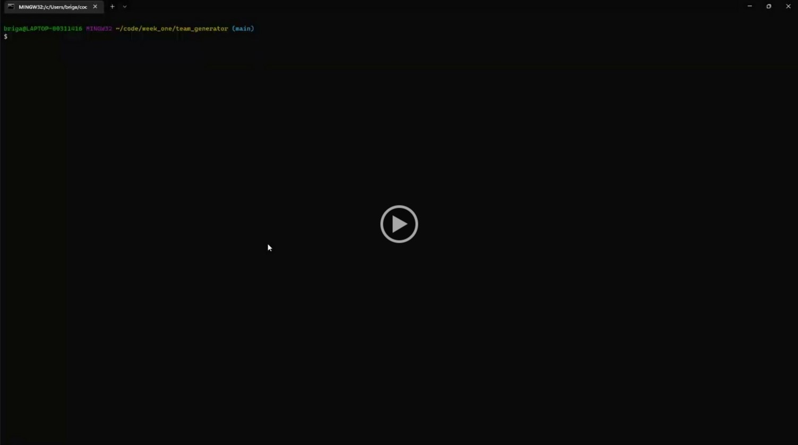

# Team Generator

## Description
There's a constant need for manager's to aggregate their employee contact information all in one place. The team generator will automatically create a static webpage with links to your employee's email and Gihub (if applicable).

## Table of Contents

- [Installation](#installation)
- [Usage](#usage)
- [Tests](#tests)

## Installation
There are two node packages used for this project (jest & inquirer), but both are stored as dependencies. After cloning this repository to your local machine, please run the following command at the root of the project directory: `npm i`. 

Node.js is also required to initiate this project. If you do not have Node.js downloaded to your device, visit [this website](https://nodejs.org/en/download/) to start the download.

## Usage
Please follow the instructions below to create your own static webpage: 
1. Open the terminal and navigate to the /team_generator directory.
2. Run the command `node index.js`.
3. The application will ask for employee information.
    - Manager cards will need a name, employee id, email, and office number.
    - Engineer cards will need a name, employee id, email, and GitHub username.
    - Intern cards will need a name, employee id, email, and School.
4. Every time you complete the criteria for one employee, the application will ask if you'd like to add another or if you'd like to exit and see your static webpage.
5. When you decide to exit the application and see the static webpage, the HTML file will be created under the `/dist` directory. 
6. You can open the HTML file from there to see your results!
7. If you'd like to see step by step instructions visually, please watch the video below.
    

## Tests
The Team Generator project includes test files used to validate object instances created by our index.js code. To run these tests, follow the instructions below:
1. Open a terminal and navigate to the /team_generator directory. 
2. To initiate tests for all four test files, run `jest /_tests_` on the command line.
3. To initiate tests for individual test files, run `jest /_tests_/filename` on the command line.

